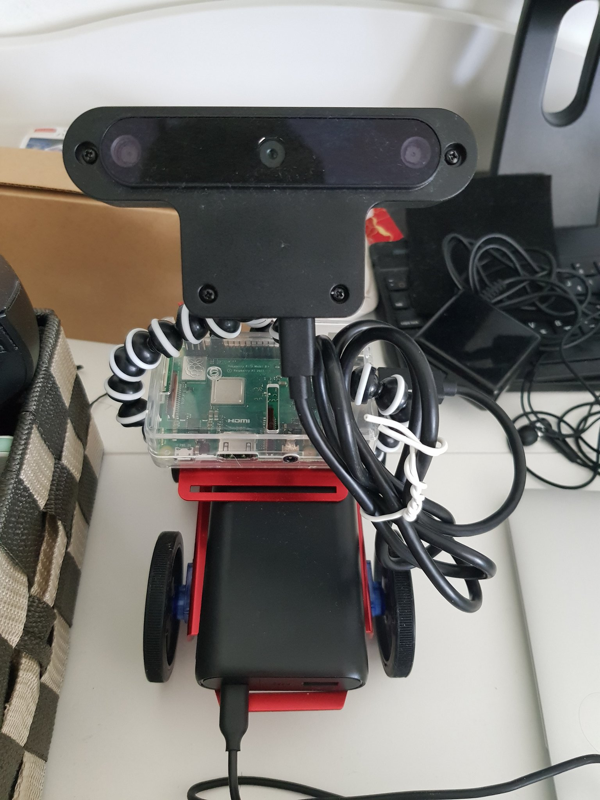
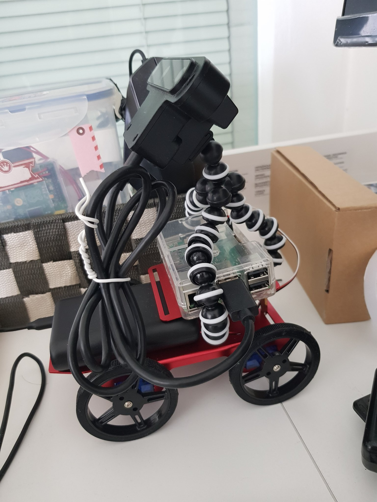
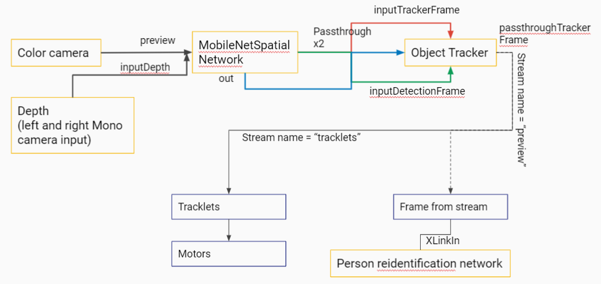
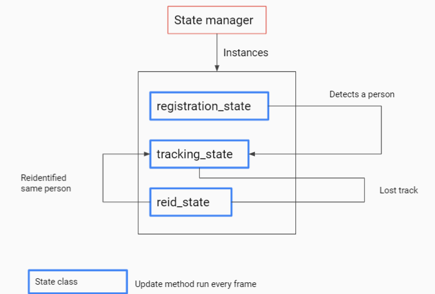

# Porter
This project aims to create a personal assistant robot that follows the user while carrying luggage and other things (like a Porter).
This is achieved by implementing person tracking and reidentification on an OAK-D device and sending the target position to a Raspberry Pi controlling motors.

# Hardware
* Raspberry Pi 3B+
* OAK-D
* Motors and motor controller, may vary

 | 

Currently I'm developing this as a proof of concept so I'm using a small and cheap robot as the moving platform

# Software
* DepthAI SDK
* Python 3
* OpenCV
* GPIO library

# Software architecture
### Overview
The robot behavior is divided into states to make it easier to develop and add further behaviors. The pipeline is also divided into classes so it will be easier to start and stop using each Neural Network component, and also to add more components in the future.

### Pipeline
The pipeline built using DepthAI SDK is as follows:

 

### States
The robot has several states that defines how it responds to input data.

* Registration state waits until it detects a person. It will save this person's feature vector for reidentification.
* Tracking state tracks the target and passes the 3D position to the MotorController which is responsible to move the motors towards target. If the tracking is lost, the robot goes into reidentification state
* Reidentification state waits until it sees a person (or persons) and compare the feature vector(s) to the one saved during Registration state. If the same person is identified the robot goes back to Tracking state.

# Future work
Currently there is only a basic barebones architecture and more features are needed such as proper person registration flow, condition to end tracking, obstacle detection and path planning etc. The roadmap will be managed as Github issues so feel free to add ideas into it!
